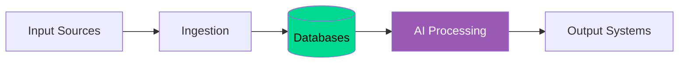

# 🎨 TheMatrix - Architecture Overview

**Quick visual reference for ADHD-friendly understanding**

---

## 🗺️ The Big Picture

TheMatrix is a **comprehensive AI-powered system** with these core components:

### 🌟 Top-Level Systems

```
┌─────────────────────────────────────────┐
│         TheMatrix Core Platform         │
└─────────────────────────────────────────┘
         │              │              │
    ┌────┴────┐    ┌────┴────┐    ┌────┴────┐
    │ Legal   │    │ Financial│    │  AI/ML  │
    │ Systems │    │ Systems  │    │ Systems │
    └────┬────┘    └────┬────┘    └────┬────┘
         │              │              │
```

### 📊 System Categories

| Category | Systems | Purpose |
|----------|---------|---------|
| 🧠 **Legal** | WizardWeb, Case Law, Section 1782 Mining | Legal analysis & research |
| 💰 **Financial** | Financial System, Vida DataHub | Budget optimization & BI |
| 🤖 **AI/ML** | ML System, Background Agents, OpenAI | Intelligent processing |
| 🎨 **Content** | Upwork Carousel (99 agents) | Social media generation |
| 📄 **Support** | Document Ingestion, NLP, Utilities | Data processing & helpers |

---

## 🔗 How It All Works Together

### Data Flow (Simplified)

```
INPUT → INGEST → STORE → ANALYZE → GENERATE → OUTPUT

PDFs/APIs → Parsers → SQLite/MySQL → AI Agents → Documents/Reports
```

### System Interactions



---

## 🎯 Quick Start Links

### 📚 Full Documentation
- **[Complete Visual Architecture](VISUAL_ARCHITECTURE.md)** - Comprehensive system diagrams
- **[Main Documentation Index](README.md)** - All documentation links
- **[Project Valuation](PROJECT_VALUATION_SUMMARY.md)** - Business value analysis

### 🧠 Core Systems
- **[WizardWeb Legal Engine](../writer_agents/)** - Bayesian network + writer agents
- **[Financial System](../financial_system/)** - AI budget optimization
- **[Vida DataHub](../vida_datahub/)** - Business intelligence
- **[ML System](../ml_system/)** - Machine learning models
- **[Background Agents](../background_agents/)** - Local LLM processing

### 🎨 Agent Systems
- **[Upwork Carousel](../Upwork---Hari-/)** - 99-agent Instagram system
- **[Agent Architecture](../Upwork---Hari-/docs/COMPLETE_AGENT_ARCHITECTURE.md)** - Complete agent breakdown

---

## 📊 System Status at a Glance

| System | Status | Agents | Purpose |
|--------|--------|--------|---------|
| 🧠 WizardWeb Legal | ✅ Production | 12+ | Legal writing & analysis |
| 🎨 Upwork Carousel | ✅ Production | 99 | Instagram content |
| 🤖 ML System | ✅ Production | 3 | Predictions & classification |
| 💰 Financial System | ✅ Production | AI | Budget optimization |
| 📊 Vida DataHub | ✅ Production | 3 | Business intelligence |
| 🔄 Background Agents | ✅ Production | 5 | Local LLM processing |

---

## 🚀 Technologies Used

- **AI:** OpenAI GPT-4, Ollama (local LLMs), AutoGen, Semantic Kernel
- **ML:** PyTorch, TensorFlow, scikit-learn
- **Databases:** SQLite, MySQL, ChromaDB
- **Languages:** Python 3.11+, JavaScript, PowerShell
- **Frontend:** Streamlit, React
- **Tools:** PySMILE (Bayesian networks), PDF processing, NLP

---

## 📈 Key Statistics

- **Total Lines of Code:** 30,620+
- **Total Agents:** 150+ specialized agents
- **Databases:** 6+ (SQLite, MySQL, ChromaDB)
- **Data Sources:** 15+ (PDFs, APIs, web scraping)
- **Legal Cases:** 10,000+ in database
- **Accuracy:** 89% on real legal cases

---

## 💡 For ADHD/Autistic Minds

This architecture is designed to be **visually friendly** and **easy to navigate**:

- ✅ **Mermaid diagrams** - Visual, interactive, color-coded
- ✅ **Clear separations** - Each system in its own section
- ✅ **Tables** - Structured information at a glance
- ✅ **Emoji markers** - Quick visual identification
- ✅ **Clickable links** - Easy navigation
- ✅ **Concise sections** - No information overload

---

## 🎓 How to Explore

1. **Start Here** → Get the big picture
2. **Click VISUAL_ARCHITECTURE.md** → See all diagrams
3. **Follow links** → Dive into specific systems
4. **Check tables** → Find exactly what you need

---

**Quick Navigation:**
- 📖 [Full Documentation](VISUAL_ARCHITECTURE.md)
- 🎯 [System Status](#-system-status-at-a-glance)
- 🔗 [Technology Stack](#-technologies-used)

---

*Last Updated: December 2025 | Version: 2.3.0*

