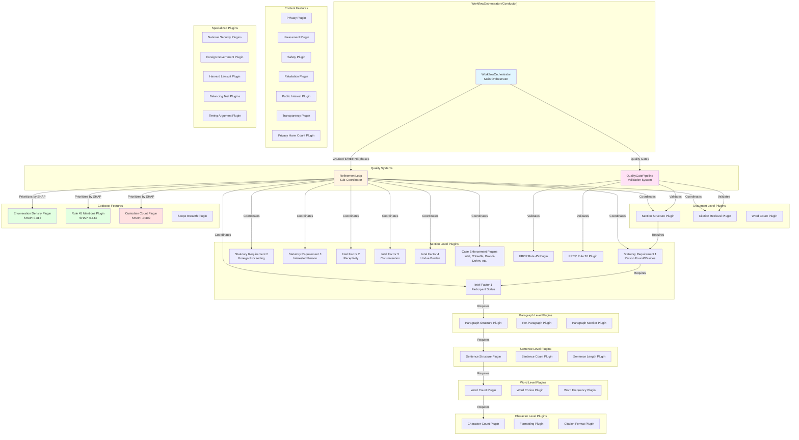
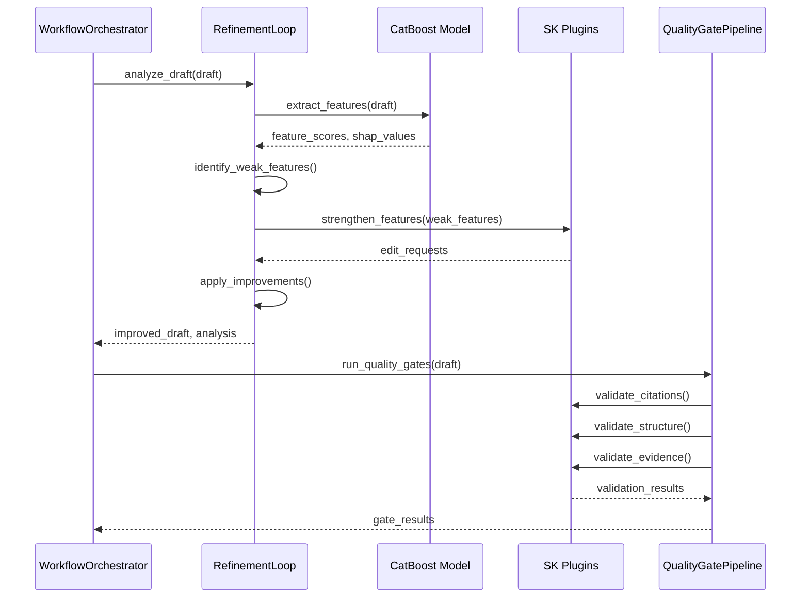
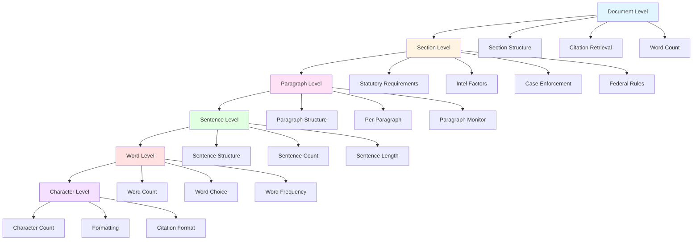

# 📊 Plugin Network Architecture Diagram

**Created:** 2025-11-06
**Purpose:** Visual representation of the plugin system hierarchy and relationships

---

## 🎯 Quick Reference

- **Plugin Registry:** [plugin_registry.json](../config/plugin_registry.json)
- **Interactive HTML:** [plugin_network.html](plugin_network.html)
- **Master Checklist:** [LEGAL_CHECKLISTS_SCAFFOLD.md](LEGAL_CHECKLISTS_SCAFFOLD.md)

---

## 📐 Mermaid Diagram

---

## 🔄 Integration Flow

---

## 📈 Plugin Hierarchy

---

## 🎯 Key Relationships

### Dependency Chain
1. **Document Level** → Foundation for all other levels
2. **Section Level** → Depends on document structure
3. **Paragraph Level** → Depends on section structure
4. **Sentence Level** → Depends on paragraph structure
5. **Word Level** → Depends on sentence structure
6. **Character Level** → Depends on word structure

### Integration Points
- **RefinementLoop** coordinates all plugins during VALIDATE/REFINE phases
- **QualityGatePipeline** validates outputs using selected plugins
- **CatBoost** provides SHAP importance for prioritization
- **WorkflowOrchestrator** manages overall workflow and calls subsystems

---

**Last Updated:** 2025-11-06
**Status:** ✅ Complete
